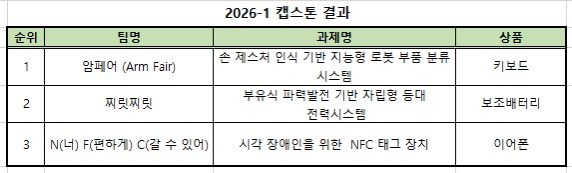
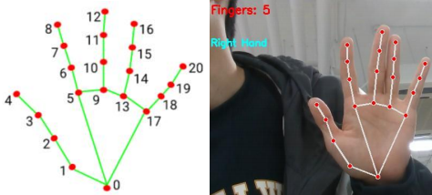
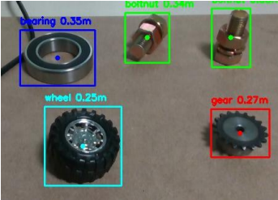
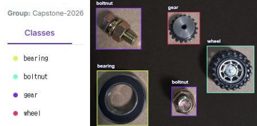
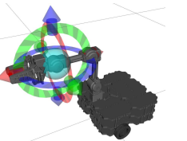

# 🏆 손 제스처 인식 기반 지능형 로봇 부품 분류 시스템 (2026 Capstone)

> **🎉 2026-1 캡스톤 설계 경진대회 1등 수상작**
>
> <div align="center">
>   
> </div>

**Team 암페어(Arm Fair)**: 정동혁, 김동욱, 김태욱, 신동익, 정규민 / 지도교수 이명훈
**인천대학교 전기공학과 (Department of Electrical Engineering, Incheon National University)**

---

## 🎥 전체 동작 영상
<div align="center">
  
</div>

## 📌 Motivation
* 스마트 팩토리 환경의 발전으로 로봇 기반 자동화 기술의 중요성이 증가하고 있습니다.
* 기존 로봇 제어 방식은 별도의 조작 장치나 프로그래밍 지식이 필요한 경우가 많아, 작업자가 로봇을 직관적으로 제어하는 데 한계가 있습니다.
* 본 프로젝트는 AI 비전 기술과 로봇팔 제어를 결합하여, 손 제스처만으로 부품을 선택하고 자동으로 인식·분류하는 시스템을 구현하고자 합니다.

## 🎯 Project Goal
**AI 비전 기반 부품 인식:** YOLO 모델 기반 4종 부품의 종류 및 위치를 인식하고, D435i 카메라의 영상 및 깊이 정보를 활용하여 3차원 좌표를 획득합니다.
**손 제스처 기반 직관적 제어:** MediaPipe 기반으로 손가락 개수를 인식하고, 이에 따라 분류 대상 부품을 선택합니다.
**로봇팔 기반 자동 분류:** 인식된 부품 좌표를 활용하여 로봇팔을 제어하고, 사용자의 제스처 명령에 따라 선택 부품만 자동으로 분류합니다.

## ⚙️ System Progress & Technologies

### 1. 데이터셋 구축 및 AI 모델 학습

<div align="center">
  
</div>

<div align="center">
  
  
</div>

* **YOLO 기반 부품 인식:** 베어링(bearing), 볼트(boltnut), 기어(gear), 바퀴(wheel) 4종 부품 이미지 데이터를 수집하여 Roboflow 기반 라벨링을 수행했습니다. 전처리 및 데이터 증강을 적용한 통합 데이터셋으로 YOLO 모델을 학습하여 실시간으로 부품 종류와 바운딩 박스 중심 좌표를 추출합니다. 추론 주기 조정을 통해 연산 부하를 줄이고 동작 안정성을 확보했습니다.
* **MediaPipe 제스처 인식:** MediaPipe Hands를 활용하여 손 모양 및 손가락 개수를 실시간 검출합니다. 손가락 개수에 따라 분류 대상 부품이 선택되며, 선택된 클래스만 인식하도록 YOLO 검출 결과를 필터링합니다.

### 2. 3차원 좌표 변환 및 모션 플래닝

<div align="center">
  
</div>

* **좌표 변환:** D435i 깊이 정보와 YOLO 바운딩 박스 중심 좌표를 기반으로 부품의 3차원 위치를 계산한 뒤, Camera 좌표계에서 Robot Base 좌표계로 변환합니다. 안정적인 파지를 위해 접근 위치 파지 오프셋 보정을 적용했습니다.
* **MoveIt 2 기반 제어:** MoveIt 2 내부 역기구학 솔버를 이용하여 목표 좌표에 대한 관절각을 계산하고 궤적을 생성합니다. 접근 자세, 파지 자세, 이동 자세 기반의 Pick & Place 시퀀스를 구성하여 구동합니다.

### 3. 하드웨어 제작 및 시스템 통합
* D435i 카메라 장착용 엔드이펙터 상단 마운트를 설계하고 3D 프린팅으로 제작했습니다.
* TurtleBot 3 외장 케이스를 MDF 합판으로 제작하고 부품 분류용 적재함을 배치했습니다.
* ROS 2 Humble을 활용하여 비전 인식 노드와 로봇팔 제어 노드를 분리 개발하고, 하나의 런치 파일로 YOLO, MediaPipe, 로봇팔 제어 노드를 동시 실행할 수 있도록 통합했습니다.

## 🛠 Problems & Solutions (문제점 및 해결 방안)
* **클래스별 학습 파일 분리 시 인식률 저하:** 4종 부품을 하나의 데이터셋으로 통합하여 YOLO 모델을 재학습함으로써 해결했습니다.
* **왼손·오른손 구분에 따른 손가락 카운팅 오류:** 손등 기준 인식은 안정성이 낮아 손바닥 기준 엄지와 새끼손가락 좌표를 비교하는 방식으로 변경하여 좌·우 손을 명확히 구분했습니다. 또한 인식 대상 손의 수를 1개로 제한하여 안정성을 높였습니다.
* **로봇팔 장착 위치로 인한 작업대 시야 부족:** 로봇팔을 본체 끝부분에 배치하고 그리퍼 높이를 조정하여 카메라 시야를 확보했습니다.
* **Pick 동작 중 로봇 본체 들림 발생:** 로봇 본체를 바닥면에 볼트로 고정하여 동작 안정성을 확보했습니다.
* **방향성 제어 한계:** 그리퍼 Yaw축 제어 한계를 보완하기 위해, 방향성 영향이 적은 대칭형 부품을 중심으로 시스템 검증을 진행했습니다.

## 🛠 하드웨어 구성
- **Robot:** TurtleBot 3 OpenManipulator-X
- **Sensor:** Intel RealSense D435i (또는 호환 카메라)
- **Controller:** PC (Ubuntu 22.04 / ROS 2 Humble 권장)

## 📂 패키지 및 노드 설명

### 1. `vision_pkg` (`vision_master_node4.py`)
- **역할:** 비전 인식 및 좌표 계산 서버
- **주요 기능:**
  - RealSense RGB-D 정렬(Align) 및 Depth 데이터 기반 3D 좌표 추출
  - 카메라 좌표계 -> `base_link` 좌표계 변환 (오프셋 보정 포함)
  - `/vision/detections`: 인식된 모든 물체의 정보를 JSON 형식으로 발행
  - 실시간 GUI를 통해 인식 결과(Bounding Box, XYZ 좌표, FPS) 시각화

### 2. `control_pkg` (`test_node7.py`)
- **역할:** 로봇 팔 동작 제어 및 시퀀스 관리
- **주요 기능:**
  - `/pick_command`: 입력된 명령(1~4)에 따라 특정 클래스 부품 분류 시작
  - **Leftmost 전략:** 동일 클래스가 여러 개일 경우 가장 왼쪽에 있는 물체부터 우선 처리
  - **정밀 보정:** 원거리 물체에 대한 Z축 높이 보정 및 그리퍼 수직 유지 제약(Orientation Constraint) 적용
  - 인식 자세(Vision Pose)와 투입 위치(Drop Zone) 간 자동 이동

## 🚥 통신 프로토콜 (Topic)

| Topic 명 | 타입 | 설명 |
| :--- | :--- | :--- |
| `/vision/detections` | `std_msgs/String` | 인식된 객체들의 리스트 (JSON: class, x, y, z 등) |
| `/pick_command` | `std_msgs/Int32` | 작업 명령 (1:Bearing, 2:Boltnut, 3:Gear, 4:Wheel) |
| `/arm_controller/joint_trajectory` | `trajectory_msgs/JointTrajectory` | 관절 각도 기반 직접 제어 |

## 🚀 실행 방법

### 환경 설정
```bash
# 워크스페이스 빌드
cd ~/capstone_ws
colcon build --symlink-install
source install/setup.bash
```

###시스템 구동 시퀀스
```bash
Terminal 1 (SSH to Robot):
ssh [USER_NAME]@[ROBOT_IP]
ros2 launch turtlebot3_manipulation_bringup hardware.launch.py
```

```bash
Terminal 2 (Remote PC - MoveIt 2):
ros2 launch turtlebot3_manipulation_moveit_config moveit_core.launch.py use_sim_time:=false
```

```bash
Terminal 3 (Remote PC - Vision & Control Launch):
ros2 launch control_pkg capstone_final.launch.py
```
